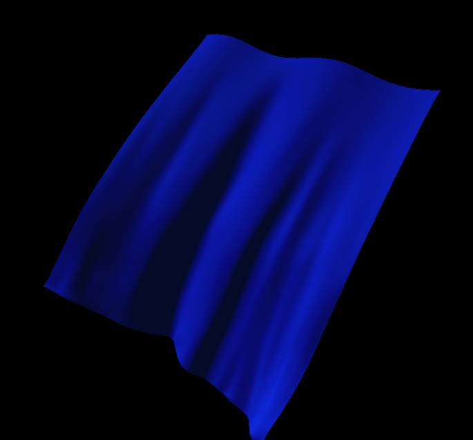

# Fabrik 

To run, all you need is to type `make` and `./fabric_run`

From reading "Mathematics for 3D Game Programming and Computer Graphics" by Eric Lengyel I implemented a cloth simulator.

I originally implemeted this and added it to my old githhub. I am adding it to this github with some improvements. Mainly a Makefile.

The idea is to consider particles connected to neighbours by springs and dampers:

each "connection" in the above diagram represents a spring AND a damper. 
