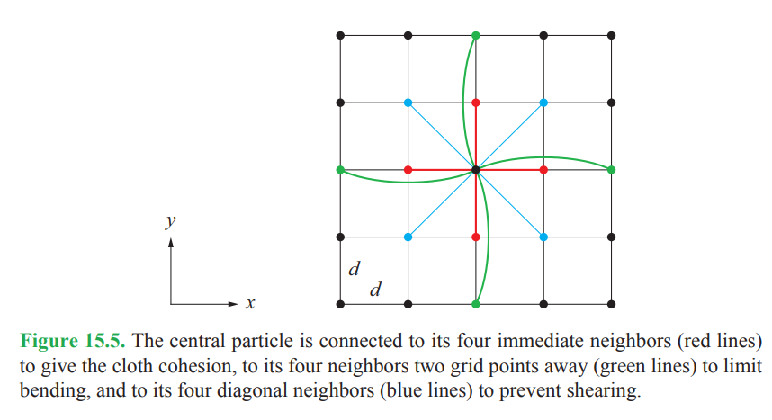

# Fabrik 

To run, all you need is to type `make` and `./fabric_run`

From reading "Mathematics for 3D Game Programming and Computer Graphics" by Eric Lengyel I implemented a cloth simulator.

I originally implemeted this and added it to my old githhub. I am adding it to this github with some improvements. Mainly a Makefile.

The idea is to consider particles connected to neighbours by springs and dampers:

each "connection" in the above diagram represents a spring AND a damper. Once the forces are all updated, we use basic point-like physics to update the positions of all thr particles in the cloth object.

I have not mastered the init parameters, so I really need to work on getting these correct. At the moment the physics is off. The cloth moves in slow motion, but if you wait long enough and let the simulation run you obtain some nice images.  
